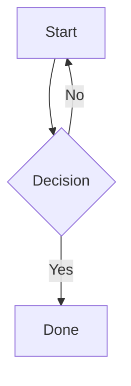
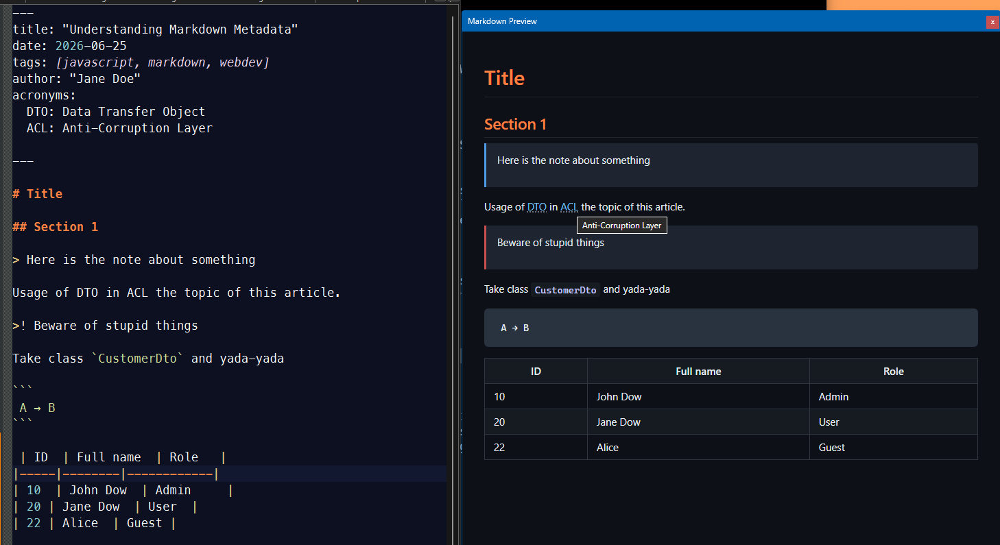

# NMD — Modern Markdown Viewer for Notepad++

A high-performance, distraction-free Markdown live preview panel for Notepad++ powered by Microsoft WebView2 (Chromium). Built in native C++ with full offline engines for syntax highlighting, diagrams, and front-matter.

---

## Key Features

- **Single Standalone DLL:** Statically links `WebView2LoaderStatic.lib`. No secondary loader DLLs, external runtimes, or extra files required—just drop `NMD.dll` in and go.
- **VS Code-Grade Syntax Highlighting:** Powered by **[Shiki](https://shiki.style/)** using authentic TextMate grammars for token-accurate syntax coloring, line numbers, language badges, and 1-click clipboard copy.
- **Real, 100% Offline Mermaid.js:** Embeds the full official **[Mermaid](https://mermaid.js.org/)** engine. Sequence diagrams, state machines, class diagrams, ER models, Gantt charts, and flowcharts work out of the box with zero network requests.
- **Standard-Compliant Markdown:** Powered by **`marked.js`** for strict CommonMark and GitHub Flavored Markdown (GFM) compliance (tables, task lists, strikethrough, autolinks).
- **YAML Front-Matter & Extensions:** Cleanly formats document front-matter and supports custom features like automatic acronym definitions (`<abbr>` tooltips).
- **True Bi-Directional Scroll Sync:** Seamlessly tracks your position both ways—scroll in Notepad++ to move the preview, or scroll the preview to jump your editor cursor.
- **Smart Document Navigation:** Relative Markdown links (`[next](adr/002.md)`) automatically open the target file in a new Notepad++ tab; web links launch in your default browser.
- **Window & Zoom Persistence:** Automatically preserves panel position, size, and custom zoom levels across Notepad++ restarts in `%APPDATA%\Notepad++\plugins\config\NMD.ini`.

---

## Installation

### Method 1: Plugins Admin (Recommended)
> *Note: Submission to Notepad++ Plugins Admin is currently in progress! Once merged, NMD will be installable directly from **Plugins → Plugins Admin...***

### Method 2: Manual Download
1. Download the latest **`NMD-v1.0.0-x64.zip`** from [GitHub Releases](https://github.com/VioletTape/notepad_md_plugin/releases).
2. Create a folder named `NMD` in your Notepad++ `plugins` directory:
   ```text
   C:\Program Files\Notepad++\plugins\NMD\
   ```
3. Extract `NMD.dll` directly into that folder:
   ```text
   Notepad++\plugins\NMD\
       └── NMD.dll
   ```
4. Restart Notepad++.
5. Open the preview anytime via **Plugins → NMD → Toggle Preview** (or map a shortcut via **Settings → Shortcut Mapper**).

---

## Syntax Highlighting (Shiki)

Fenced code blocks are highlighted automatically using VS Code's actual syntax engine:

````markdown
```csharp
public record Point(int X, int Y);
```
````

### Supported Languages (Embedded & 100% Offline):
| Category | Languages |
| :--- | :--- |
| **Systems & Native** | C++ (`cpp`), Rust (`rust`), Go (`go`), C# (`csharp`) |
| **Web & Scripting** | JavaScript (`javascript` / `js`), TypeScript (`typescript` / `ts`), Python (`python`), HTML (`html`), CSS (`css`), Bash / Shell (`bash` / `shell`) |
| **Data & Query** | JSON (`json`), YAML (`yaml`), XML (`xml`), SQL (`sql`), Markdown (`markdown`) |

Tagged code blocks feature:
- Clean header with the language badge
- Convenient 1-click **Copy** button
- Line numbers
- Automatic soft-wrapping

*(Untagged code blocks still include the 1-click Copy button without language headers or line numbering.)*

---

## Offline Mermaid Diagrams

NMD embeds the complete official Mermaid.js engine offline in the DLL. All standard diagrams render identically to GitHub:

````markdown

````

**Supported Diagram Types:**
- Flowcharts & Architecture Graphs (`graph`, `flowchart`)
- Sequence Diagrams (`sequenceDiagram`)
- Class & State Diagrams (`classDiagram`, `stateDiagram-v2`)
- Entity Relationship (ER) Schemas (`erDiagram`)
- Gantt Charts & User Journeys (`gantt`, `journey`)
- Git Graphs & Mindmaps (`gitGraph`, `mindmap`)

---

## Synchronized Scrolling

The editor and preview stay synchronized in real time:
- **Editor → Preview:** As you scroll or type in Notepad++, the preview smoothly tracks the corresponding heading or section.
- **Preview → Editor:** Scrolling inside the preview panel scrolls the Notepad++ Scintilla view to match.
- **Debounced Rendering:** Live preview refreshes 300 ms after the last keystroke, keeping typing responsive even on massive files.

---

## Front-Matter & Custom Extensions

NMD parses and formats YAML front-matter into a clean metadata card at the top of your document.

It also supports custom extensions such as the `acronyms:` block:
```yaml
---
title: System Architecture
acronyms:
  API: Application Programming Interface
  DOM: Document Object Model
---
```
Any occurrences of `API` or `DOM` throughout the document are automatically wrapped in interactive `<abbr>` elements with hover tooltips.

---

## Smart File Linking

- **Local links** (`[design doc](docs/design.md)` or `[sub-folder](../other.md)`) resolve relative to the open file and open directly in a new Notepad++ tab.
- **External links** (`https://...`, `mailto:...`) open safely in your default web browser.

---

## Window Persistence & Configuration

Your preview preferences persist across sessions in:
`%APPDATA%\Notepad++\plugins\config\NMD.ini`

Saved settings include:
- Window position, dimensions, and docking state
- Custom zoom factor (zoom in/out inside preview)

---

## Building from Source

1. Open `NMD.sln` in **Visual Studio 2022**.
2. Select **Release** and **x64**.
3. Build the solution.
4. Output binary is placed in `x64/Release/NMD.dll`.

## Preview of visuals



