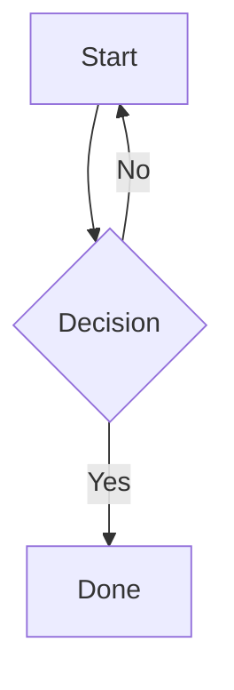

# NMD — Notepad++ Markdown Preview 

A Notepad++ plugin that renders a live Markdown preview in a side panel powered by WebView2.

## Installation 

1. Build `NMD.dll` (Visual Studio 2022, x64 Release).
2. Copy it to ` C:\Program Files\Notepad++\plugins`.
3. Restart Notepad++.

The preview panel toggles via **Plugins → NMD → Toggle Preview**.

## Syntax Highlighting 

Fenced code blocks are highlighted automatically when a language tag is provided:

````markdown
```csharp
public record Point(int X, int Y);
```
````

Powered by [Shiki](https://shiki.style/) (embedded in the DLL — works offline).

### Supported languages 

| Tag | Language |
|---|---|
| `bash` / `shell` | Bash / Shell |
| `cpp` | C++ |
| `csharp` | C# |
| `css` | CSS |
| `go` | Go |
| `html` | HTML |
| `javascript` | JavaScript |
| `json` | JSON |
| `markdown` | Markdown |
| `python` | Python |
| `rust` | Rust |
| `sql` | SQL |
| `typescript` | TypeScript |
| `xml` | XML |
| `yaml` | YAML |

Blocks without a language tag are rendered as plain text (no highlighting).

## Mermaid Diagrams

Fenced code blocks tagged `mermaid` are rendered as diagrams:

````markdown

````

Powered by [Mermaid](https://mermaid.js.org/) (embedded in the DLL — works offline). All diagram types are supported: flowcharts, sequence diagrams, ER diagrams, Gantt charts, etc.

## Window Persistence

The preview window remembers its position, size, and zoom level between Notepad++ sessions.
Settings are saved to `%APPDATA%\Notepad++\plugins\config\NMD.ini` whenever the window is moved, resized, or zoomed.

## Local File Navigation

Clicking a relative link in the preview opens the target file in Notepad++.
Links are resolved relative to the directory of the currently active file, so `[next](adr/002.md)` opens `adr/002.md` next to the current document.
External `http://`, `https://`, and `mailto:` links open in the default browser.

## Scroll Sync

The editor and preview stay in sync automatically:

- **Editor → Preview** — scrolling in Notepad++ moves the preview to the matching section.
- **Preview → Editor** — scrolling the preview panel moves the editor to the corresponding line.

## Markdown Features 

- CommonMark + GitHub Flavored Markdown (tables, task lists, strikethrough)
- Front-matter `acronyms:` block — defines abbreviations rendered as `<abbr>` tooltips
- Live preview updates 300 ms after the last keystroke


